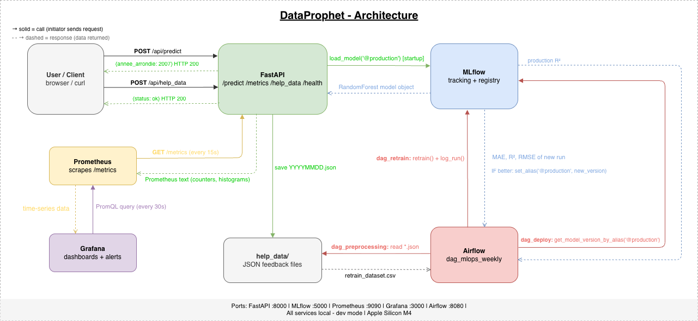
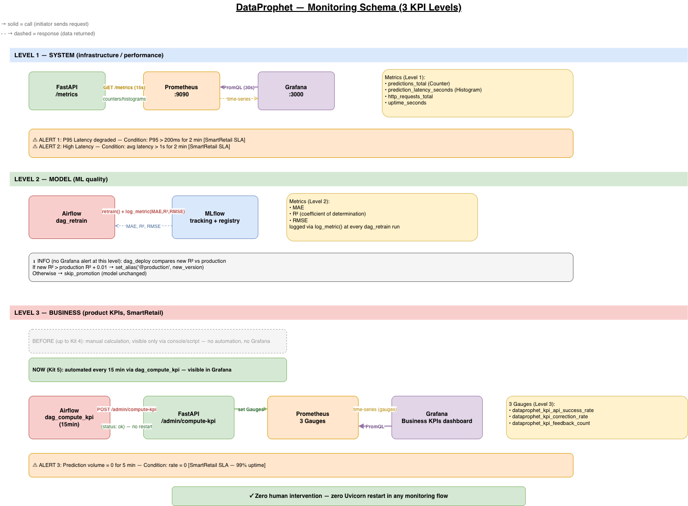
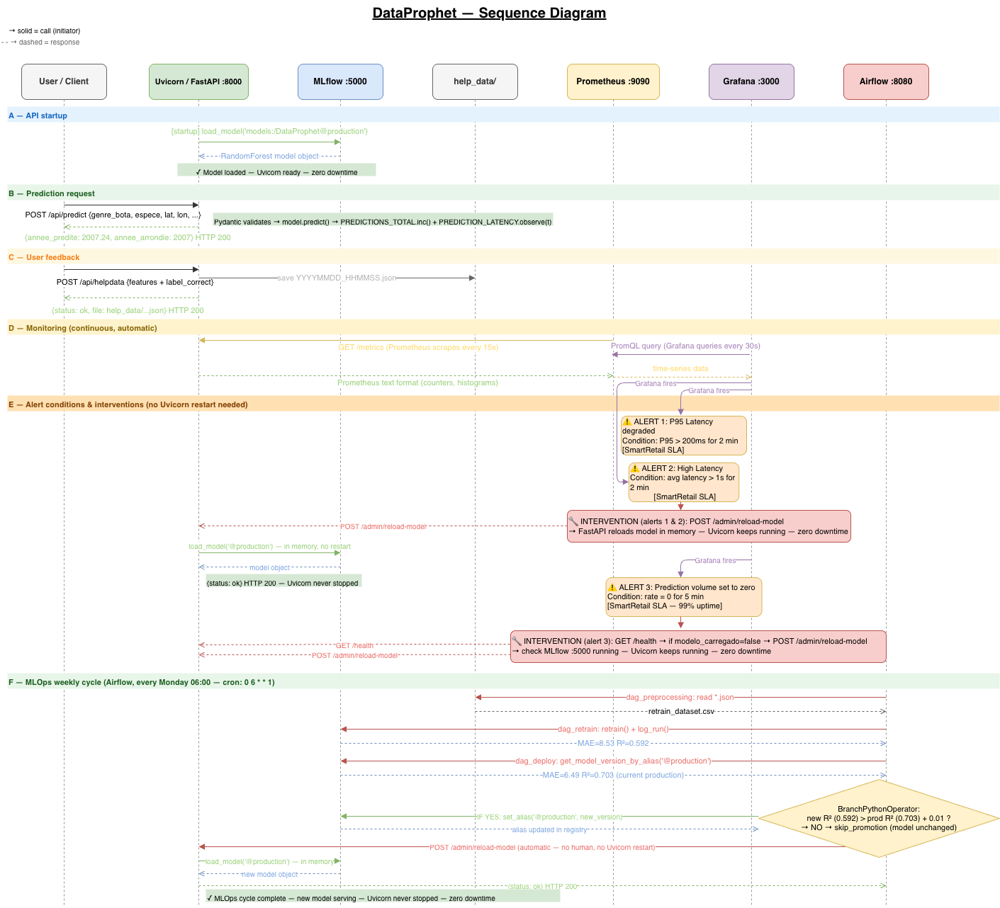

# DataProphet — Grenoble Urban Trees

MLOps API for predicting the planting year of urban trees in Grenoble.  
Model: RandomForestRegressor trained on 31,670 trees (R² = 0.70).

---

## Architecture

```
dataprophet/
├── main.py                    # FastAPI app (prediction, metrics, feedback, reload, KPI)
├── schemas.py                 # Pydantic schemas (ArvoreFeatures, HelpData)
├── metrics.py                 # Prometheus metrics (Counter, Histogram, Gauge)
├── train.py                   # Initial training + MLflow logging
├── retrain.py                 # Automated retraining + model promotion logic
├── compute_kpi.py             # Standalone KPI computation script
├── analyse_retraining.md      # Before/after retraining analysis
├── tool_choices.md            # Tool justification document
├── dags/                      # Airflow DAGs
│   ├── dag_preprocessing.py
│   ├── dag_retrain.py
│   ├── dag_deploy.py
│   ├── dag_mlops_weekly.py
│   └── dag_compute_kpi.py
├── prometheus.yml             # Prometheus scraping configuration
├── docker-compose.yml         # MLflow + Prometheus + Grafana
├── environment.yml            # Conda environment
└── README.md

```
System architecture overview:


This diagram represents the complete production architecture: FastAPI (prediction + feedback + metrics), MLflow Tracking + Registry, Prometheus, Grafana, Airflow DAGs, and the help_data/ feedback loop.

---

## Technology Stack

| Component | Technology |
| --- | --- |
| API Server | Uvicorn 0.29 (ASGI) |
| API Framework | FastAPI 0.111 |
| Model | scikit-learn 1.2.2 (RandomForest) |
| Experiment Tracking | MLflow 3.13 |
| Model Registry | MLflow Registry (``production`` alias) |
| Metrics | prometheus-client 0.25 |
| Monitoring | Prometheus 3.12 + Grafana 13 |
| Orchestration | Apache Airflow 2.9.1 |
| Environment | Conda (Python 3.11) |

> **Note on Uvicorn:** Uvicorn note:  
The model is loaded once at startup via lifespan().
After a promotion, dag_deploy automatically calls POST /admin/reload-model,
loading the new model **in memory with zero downtime.**

---

## Installation

```bash
# 1. Create and activate the environment
conda env create -f environment.yml
conda activate dataprophet

# 2. Install additional dependencies
pip install mlflow prometheus-client apache-airflow==2.9.1
```

---

## Starting the services

### 1. MLflow Tracking Server
```bash
mlflow server --host 0.0.0.0 --port 5000 &
```

### 2. Train and register the model
```bash
python train.py --n_estimators 100 --max_depth 15
```
Promote the model to Production via MLflow UI (`http://localhost:5000`):  
Models → DataProphet → Version 1 → Aliases → `production`

### 3. Uvicorn / FastAPI
```bash
uvicorn main:app --reload --port 8000
```

Reload the Production model without restarting Uvicorn:
```bash
curl -X POST http://localhost:8000/admin/reload-model
```

### 4. Prometheus
```bash
prometheus --config.file=/absolute/path/to/prometheus.yml --web.listen-address=":9090" &
```
> Use absolute path — Prometheus does not expand `~` in `--config.file`.

### 5. Grafana
```bash
grafana server --homepath /opt/homebrew/share/grafana &
```
Access: `http://localhost:3000` (admin/admin)

### 6. Airflow
```bash
export AIRFLOW__CORE__DAGS_FOLDER=$(pwd)/dags
airflow standalone
```
Access: `http://localhost:8080` (admin / see terminal output for password)

---

## Endpoints

| Method | Route | Description |
| --- | --- | --- |
| GET | ``/health`` | API health check |
| GET | ``/metrics`` | Prometheus metrics |
| POST | ``/api/predict`` | Predict planting year |
| POST | ``/api/helpdata`` | Submit user feedback |
| POST | ``/admin/reload-model`` | Reload Production model (zero downtime) |
| POST | ``/admin/compute-kpi`` | Compute Level 3 Business KPI |

---

## Prediction Example

```bash
curl -X POST http://localhost:8000/api/predict \
  -H "Content-Type: application/json" \
  -d '{
    "genre_bota": "Prunus",
    "espece": "serrulata",
    "stadededeveloppement": "Arbre jeune",
    "hauteurarbre": "Moins de 10 m",
    "typenature": "Libre",
    "latitude": 45.167,
    "longitude": 5.740
  }'
```

Response:
```json
{
  "annee_predite": 2007.24,
  "annee_arrondie": 2007
}
```

---

## Feedback Loop (Closing the MLOps Cycle)

```bash
curl -X POST http://localhost:8000/api/helpdata \
  -H "Content-Type: application/json" \
  -d '{
    "genre_bota": "Prunus",
    "espece": "serrulata",
    "stadededeveloppement": "Arbre jeune",
    "hauteurarbre": "Moins de 10 m",
    "typenature": "Libre",
    "latitude": 45.167,
    "longitude": 5.740,
    "annee_correcte": 2010
  }'
```

Feedback is saved to help_data/ and processed by Airflow on the next run.

---

## Model Reload (zero downtime)

```bash
curl -X POST http://localhost:8000/admin/reload-model
```

Response:
```json
{
  "status": "ok",
  "message": "Model successfully reloaded: models:/DataProphet@production"
}
```

---

## Business KPI (Level 3)

Two ways to compute it:

**1. Standalone script:**
```bash
python compute_kpi.py
```

**2. API endpoint (feeds Grafana):**
```bash
curl -X POST http://localhost:8000/admin/compute-kpi
```

Updated every 15 minutes by dag_compute_kpi.

---

## Automated MLOps Pipeline (Airflow)

### Weekly retraining cycle
Runs every Monday at 6am (`0 6 * * 1`) via `dag_mlops_weekly`:

```
dag_preprocessing → dag_retrain → dag_deploy
```

| DAG | Description |
| --- | --- |
| ``dag_preprocessing`` | Validates feedback, generates ``retrain_dataset.csv`` |
| ``dag_retrain`` | Runs ``retrain.py``, checks MLflow run |
| ``dag_deploy`` | Compares R², promotes if better, reloads model |
| ``dag_mlops_weekly`` | Master DAG orchestrating the cycle |

### Continuous KPI refresh
Runs every 15 minutes:

| DAG | Description |
| --- | --- |
| ``dag_compute_kpi`` | Recomputes Level 3 KPI and updates Prometheus Gauges |

To trigger manually:
1. Open `http://localhost:8080`
2. Search DAGs by tag `dataprophet`
3. Click ▶ on the desired DAG

---

## Monitoring Architecture (3 KPI Levels)



This diagram shows the three monitoring layers implemented in DataProphet:

**Level 1 — System**

- Latency (P95, average)
- Request rate
- Uptime
- Alerts based on SmartRetail SLA

**Level 2 — Model**

- MAE, RMSE, R² logged in MLflow
- Automatic comparison vs Production
- Promotion to Staging when R² improves

**Level 3 — Business**

- API success rate
- Correction rate (based on annee_correcte)
- Total feedback count

*Note: Level 3 KPIs are not required by the kit to appear in Grafana (console output alone would be sufficient).However, they were exposed through Prometheus Gauges and refreshed via dag_compute_kpi to provide continuous visibility in the monitoring dashboard.*

- Prometheus: `http://localhost:9090`
- Grafana: `http://localhost:3000` → dashboard **DataProphet — 

Includes:

- P95 latency
- Request rate
- Prediction distribution by decade
- Business KPIs (success rate, correction rate, feedback count)

---

**Sequence Diagram**



This diagram illustrates the full temporal flow:

- API startup and model loading
- Prediction requests
- Feedback ingestion
- Prometheus scraping
- Grafana visualization
- Alert conditions
- Weekly MLOps cycle (preprocess → retrain → evaluate → deploy)
- KPI automation cycle (every 15 minutes)
- Zero downtime reloads

---

## Model performance

| Version | n_estimators | max_depth | MAE | R² | Status |
|---|---|---|---|---|---|
| v1 | 100 | 15 | 6.49 years | 0.70 | **@production** |
| v2 | 50 | 10 | 8.54 years | 0.59 | — |

See `analyse_retraining.md` for the full before/after retraining analysis.